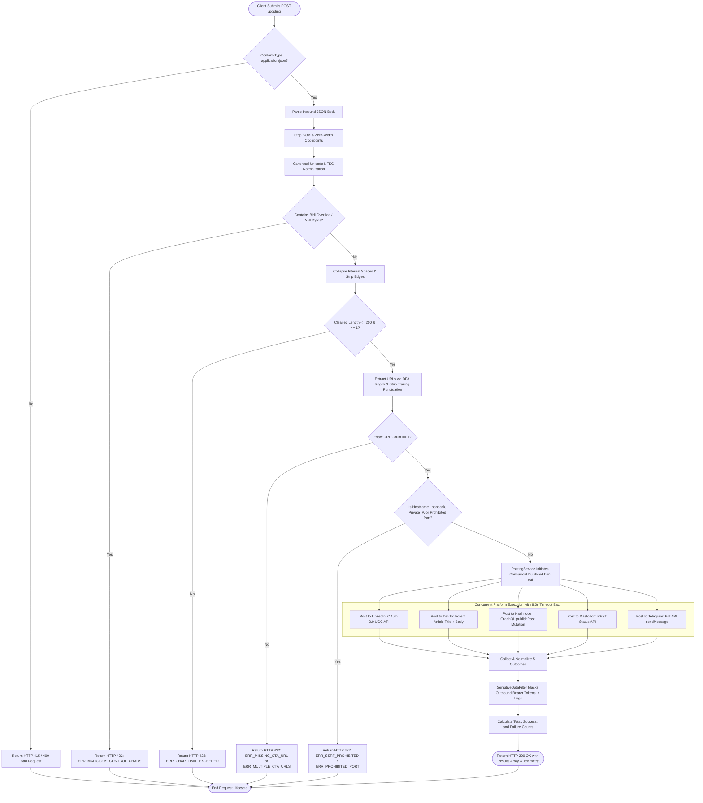

# Activity Diagram — Automated Multi-Platform Posting System

```mermaid
flowchart TD
    Start([Client Submits POST /posting]) --> MediaCheck{Content-Type == application/json?}
    MediaCheck -- No --> Return415[Return HTTP 415 / 400 Bad Request]

    MediaCheck -- Yes --> ParseJSON[Parse Inbound JSON Body]
    ParseJSON --> StripBOM[Strip BOM & Zero-Width Codepoints]
    StripBOM --> NormalizeNFKC[Canonical Unicode NFKC Normalization]
    
    NormalizeNFKC --> CheckBidi{Contains Bidi Override / Null Bytes?}
    CheckBidi -- Yes --> Return422_Bidi[Return HTTP 422: ERR_MALICIOUS_CONTROL_CHARS]

    CheckBidi -- No --> TrimWhitespace[Collapse Internal Spaces & Strip Edges]
    TrimWhitespace --> CheckLength{Cleaned Length <= 200 & >= 1?}
    CheckLength -- No --> Return422_Len[Return HTTP 422: ERR_CHAR_LIMIT_EXCEEDED]
    
    CheckLength -- Yes --> ExtractURLs[Extract URLs via DFA Regex & Strip Trailing Punctuation]
    ExtractURLs --> CheckURLCount{Exact URL Count == 1?}
    CheckURLCount -- No --> Return422_URL[Return HTTP 422: ERR_MISSING_CTA_URL or ERR_MULTIPLE_CTA_URLS]
    
    CheckURLCount -- Yes --> ScreenSSRF{Is Hostname Loopback, Private IP, or Prohibited Port?}
    ScreenSSRF -- Yes --> Return422_SSRF[Return HTTP 422: ERR_SSRF_PROHIBITED / ERR_PROHIBITED_PORT]

    ScreenSSRF -- No --> DispatchFanOut[PostingService Initiates Concurrent Bulkhead Fan-out]
    
    subgraph ParallelExecution [Concurrent Platform Execution with 8.0s Timeout Each]
        direction LR
        P1[Post to LinkedIn: OAuth 2.0 UGC API]
        P2[Post to Dev.to: Forem Article Title + Body]
        P3[Post to Hashnode: GraphQL publishPost Mutation]
        P4[Post to Mastodon: REST Status API]
        P5[Post to Telegram: Bot API sendMessage]
    end
    
    DispatchFanOut --> P1
    DispatchFanOut --> P2
    DispatchFanOut --> P3
    DispatchFanOut --> P4
    DispatchFanOut --> P5
    
    P1 --> Collect[Collect & Normalize 5 Outcomes]
    P2 --> Collect
    P3 --> Collect
    P4 --> Collect
    P5 --> Collect
    
    Collect --> MaskLogs[SensitiveDataFilter Masks Outbound Bearer Tokens in Logs]
    MaskLogs --> ComputeSummary[Calculate Total, Success, and Failure Counts]
    ComputeSummary --> Return200([Return HTTP 200 OK with Results Array & Telemetry])
    
    Return415 --> Finish([End Request Lifecycle])
    Return422_Bidi --> Finish
    Return422_Len --> Finish
    Return422_URL --> Finish
    Return422_SSRF --> Finish
    Return200 --> Finish
```
