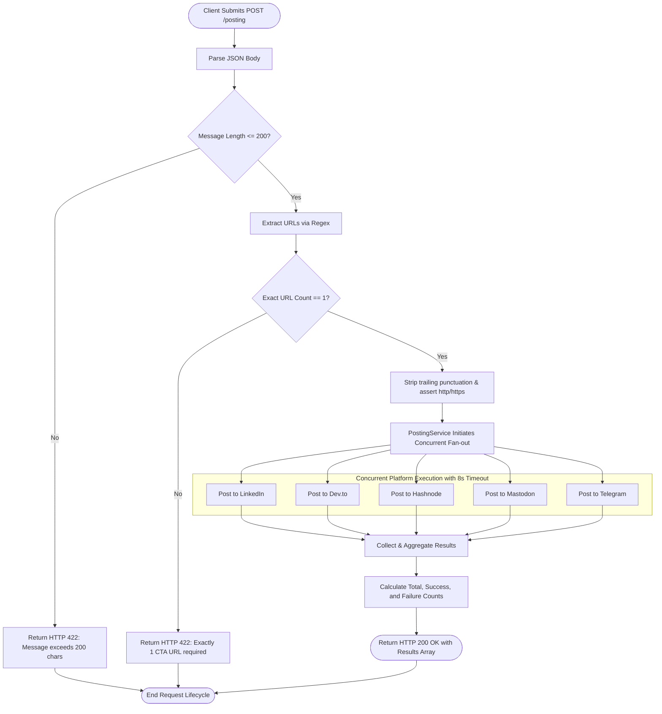

<!-- Generated by pipeline Step 13 — do not edit manually -->
# Activity Diagram — Automated Multi-Platform Posting System

```mermaid
flowchart TD
    Start([Client Submits POST /posting]) --> ParseJSON[Parse JSON Body]
    
    ParseJSON --> CheckLength{Message Length <= 200?}
    CheckLength -- No --> Return422_Len[Return HTTP 422: Message exceeds 200 chars]
    
    CheckLength -- Yes --> ExtractURLs[Extract URLs via Regex]
    ExtractURLs --> CheckURLCount{Exact URL Count == 1?}
    CheckURLCount -- No --> Return422_URL[Return HTTP 422: Exactly 1 CTA URL required]
    
    CheckURLCount -- Yes --> CleanURL[Strip trailing punctuation & assert http/https]
    CleanURL --> DispatchFanOut[PostingService Initiates Concurrent Fan-out]
    
    subgraph ParallelExecution [Concurrent Platform Execution with 8s Timeout]
        direction LR
        P1[Post to LinkedIn]
        P2[Post to Dev.to]
        P3[Post to Hashnode]
        P4[Post to Mastodon]
        P5[Post to Telegram]
    end
    
    DispatchFanOut --> P1
    DispatchFanOut --> P2
    DispatchFanOut --> P3
    DispatchFanOut --> P4
    DispatchFanOut --> P5
    
    P1 --> Collect[Collect & Aggregate Results]
    P2 --> Collect
    P3 --> Collect
    P4 --> Collect
    P5 --> Collect
    
    Collect --> ComputeSummary[Calculate Total, Success, and Failure Counts]
    ComputeSummary --> Return200([Return HTTP 200 OK with Results Array])
    
    Return422_Len --> Finish([End Request Lifecycle])
    Return422_URL --> Finish
    Return200 --> Finish
```
