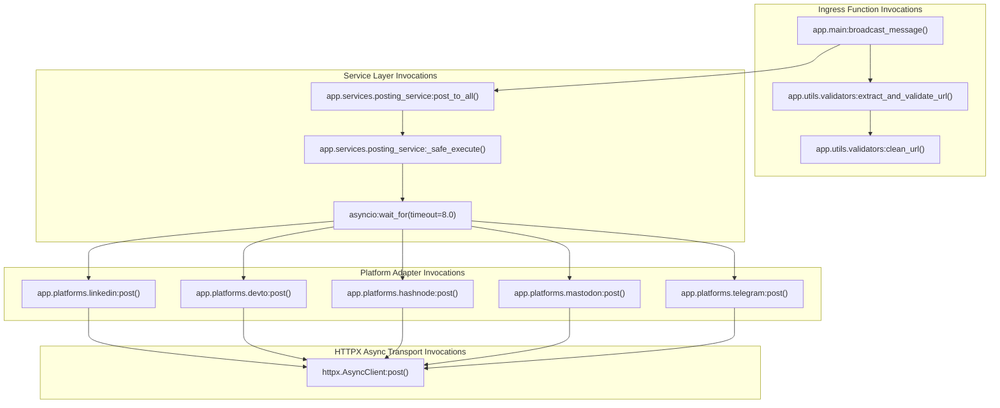

<!-- Generated by pipeline Step 13 — do not edit manually -->
# Call Graph Diagram — Automated Multi-Platform Posting System

```mermaid
graph TD
    subgraph IngressCalls [Ingress Function Invocations]
        app_main["app.main:broadcast_message()"]
        val_func["app.utils.validators:extract_and_validate_url()"]
        val_clean["app.utils.validators:clean_url()"]
    end

    subgraph ServiceCalls [Service Layer Invocations]
        svc_post_all["app.services.posting_service:post_to_all()"]
        svc_safe["app.services.posting_service:_safe_execute()"]
        async_wait["asyncio:wait_for(timeout=8.0)"]
    end

    subgraph AdapterCalls [Platform Adapter Invocations]
        li_post["app.platforms.linkedin:post()"]
        dev_post["app.platforms.devto:post()"]
        hash_post["app.platforms.hashnode:post()"]
        mast_post["app.platforms.mastodon:post()"]
        tg_post["app.platforms.telegram:post()"]
    end

    subgraph HttpCalls [HTTPX Async Transport Invocations]
        http_post["httpx.AsyncClient:post()"]
    end

    app_main --> val_func
    val_func --> val_clean
    app_main --> svc_post_all

    svc_post_all --> svc_safe
    svc_safe --> async_wait

    async_wait --> li_post
    async_wait --> dev_post
    async_wait --> hash_post
    async_wait --> mast_post
    async_wait --> tg_post

    li_post --> http_post
    dev_post --> http_post
    hash_post --> http_post
    mast_post --> http_post
    tg_post --> http_post
```
