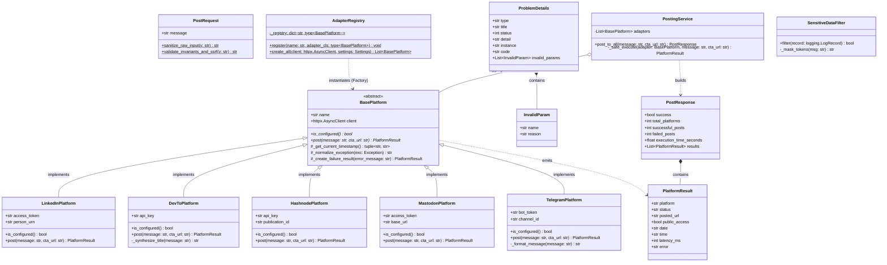

# Class Diagram — Automated Multi-Platform Posting System

```mermaid
classDiagram
    direction TB

    class PostRequest {
        +str message
        +sanitize_raw_input(v: str)$ str
        +validate_invariants_and_ssrf(v: str)$ str
    }

    class PlatformResult {
        +str platform
        +str status
        +str posted_url
        +bool public_access
        +str date
        +str time
        +int latency_ms
        +str error
    }

    class PostResponse {
        +bool success
        +int total_platforms
        +int successful_posts
        +int failed_posts
        +float execution_time_seconds
        +List~PlatformResult~ results
    }

    class ProblemDetails {
        +str type
        +str title
        +int status
        +str detail
        +str instance
        +str code
        +List~InvalidParam~ invalid_params
    }

    class InvalidParam {
        +str name
        +str reason
    }

    class BasePlatform {
        <<abstract>>
        +str name*
        +httpx.AsyncClient client
        +is_configured()* bool
        +post(message: str, cta_url: str)* PlatformResult
        #_get_current_timestamp() tuple~str, str~
        #_normalize_exception(exc: Exception) str
        #_create_failure_result(error_message: str) PlatformResult
    }

    class LinkedInPlatform {
        +str access_token
        +str person_urn
        +is_configured() bool
        +post(message: str, cta_url: str) PlatformResult
    }

    class DevToPlatform {
        +str api_key
        +is_configured() bool
        +post(message: str, cta_url: str) PlatformResult
        -_synthesize_title(message: str) str
    }

    class HashnodePlatform {
        +str api_key
        +str publication_id
        +is_configured() bool
        +post(message: str, cta_url: str) PlatformResult
    }

    class MastodonPlatform {
        +str access_token
        +str base_url
        +is_configured() bool
        +post(message: str, cta_url: str) PlatformResult
    }

    class TelegramPlatform {
        +str bot_token
        +str channel_id
        +is_configured() bool
        +post(message: str, cta_url: str) PlatformResult
        -_format_message(message: str) str
    }

    class AdapterRegistry {
        -_registry: dict~str, type~BasePlatform~~$
        +register(name: str, adapter_cls: type~BasePlatform~)$ void
        +create_all(client: httpx.AsyncClient, settings: Settings)$ List~BasePlatform~
    }

    class PostingService {
        -List~BasePlatform~ adapters
        +post_to_all(message: str, cta_url: str) PostResponse
        -_safe_execute(adapter: BasePlatform, message: str, cta_url: str) PlatformResult
    }

    class SensitiveDataFilter {
        +filter(record: logging.LogRecord) bool
        -_mask_tokens(msg: str) str
    }

    BasePlatform <|-- LinkedInPlatform : implements
    BasePlatform <|-- DevToPlatform : implements
    BasePlatform <|-- HashnodePlatform : implements
    BasePlatform <|-- MastodonPlatform : implements
    BasePlatform <|-- TelegramPlatform : implements

    AdapterRegistry ..> BasePlatform : instantiates (Factory)
    PostingService o-- BasePlatform : aggregates & orchestrates
    PostingService ..> PostResponse : builds
    BasePlatform ..> PlatformResult : emits
    PostResponse *-- PlatformResult : contains
    ProblemDetails *-- InvalidParam : contains
```
