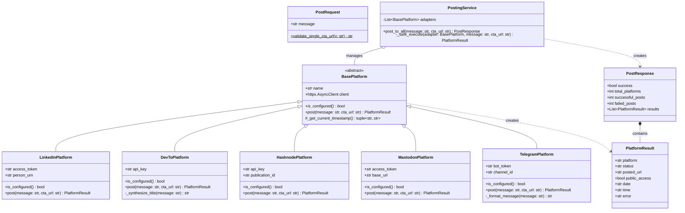

<!-- Generated by pipeline Step 13 — do not edit manually -->
# Class Diagram — Automated Multi-Platform Posting System

```mermaid
classDiagram
    direction TB

    class PostRequest {
        +str message
        +validate_single_cta_url(v: str)$ str
    }

    class PlatformResult {
        +str platform
        +str status
        +str posted_url
        +bool public_access
        +str date
        +str time
        +str error
    }

    class PostResponse {
        +bool success
        +int total_platforms
        +int successful_posts
        +int failed_posts
        +List~PlatformResult~ results
    }

    class BasePlatform {
        <<abstract>>
        +str name*
        +httpx.AsyncClient client
        +is_configured()* bool
        +post(message: str, cta_url: str)* PlatformResult
        #_get_current_timestamp() tuple~str, str~
    }

    class LinkedInPlatform {
        +str access_token
        +str person_urn
        +is_configured() bool
        +post(message: str, cta_url: str) PlatformResult
    }

    class DevToPlatform {
        +str api_key
        +is_configured() bool
        +post(message: str, cta_url: str) PlatformResult
        -_synthesize_title(message: str) str
    }

    class HashnodePlatform {
        +str api_key
        +str publication_id
        +is_configured() bool
        +post(message: str, cta_url: str) PlatformResult
    }

    class MastodonPlatform {
        +str access_token
        +str base_url
        +is_configured() bool
        +post(message: str, cta_url: str) PlatformResult
    }

    class TelegramPlatform {
        +str bot_token
        +str channel_id
        +is_configured() bool
        +post(message: str, cta_url: str) PlatformResult
        -_format_message(message: str) str
    }

    class PostingService {
        -List~BasePlatform~ adapters
        +post_to_all(message: str, cta_url: str) PostResponse
        -_safe_execute(adapter: BasePlatform, message: str, cta_url: str) PlatformResult
    }

    BasePlatform <|-- LinkedInPlatform
    BasePlatform <|-- DevToPlatform
    BasePlatform <|-- HashnodePlatform
    BasePlatform <|-- MastodonPlatform
    BasePlatform <|-- TelegramPlatform

    PostingService o-- BasePlatform : manages
    PostingService ..> PostResponse : creates
    BasePlatform ..> PlatformResult : creates
    PostResponse *-- PlatformResult : contains
```
