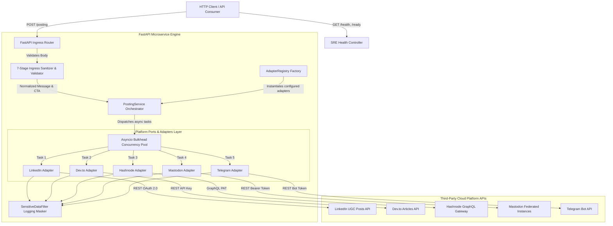

# Component Diagram — Automated Multi-Platform Posting System

```mermaid
graph TD
    Client[HTTP Client / API Consumer] -->|POST /posting| IngressRouter[FastAPI Ingress Router]
    Client -->|GET /health, /ready| HealthRouter[SRE Health Controller]

    subgraph CoreApplication [FastAPI Microservice Engine]
        IngressRouter -->|Validates Body| SchemaValidator[7-Stage Ingress Sanitizer & Validator]
        SchemaValidator -->|Normalized Message & CTA| ServiceComponent[PostingService Orchestrator]

        RegistryComponent[AdapterRegistry Factory] -->|Instantiates configured adapters| ServiceComponent
        ServiceComponent -->|Dispatches async tasks| ConcurrencyPool[Asyncio Bulkhead Concurrency Pool]

        subgraph AdapterLayer [Platform Ports & Adapters Layer]
            ConcurrencyPool -->|Task 1| LinkedInComp[LinkedIn Adapter]
            ConcurrencyPool -->|Task 2| DevToComp[Dev.to Adapter]
            ConcurrencyPool -->|Task 3| HashnodeComp[Hashnode Adapter]
            ConcurrencyPool -->|Task 4| MastodonComp[Mastodon Adapter]
            ConcurrencyPool -->|Task 5| TelegramComp[Telegram Adapter]
        end

        LinkedInComp --> LogSanitizer[SensitiveDataFilter Logging Masker]
        DevToComp --> LogSanitizer
        HashnodeComp --> LogSanitizer
        MastodonComp --> LogSanitizer
        TelegramComp --> LogSanitizer
    end

    subgraph ExternalPlatforms [Third-Party Cloud Platform APIs]
        LinkedInComp -->|REST OAuth 2.0| LinkedInAPI[LinkedIn UGC Posts API]
        DevToComp -->|REST API Key| DevToAPI[Dev.to Articles API]
        HashnodeComp -->|GraphQL PAT| HashnodeAPI[Hashnode GraphQL Gateway]
        MastodonComp -->|REST Bearer Token| MastodonAPI[Mastodon Federated Instances]
        TelegramComp -->|REST Bot Token| TelegramAPI[Telegram Bot API]
    end
```
