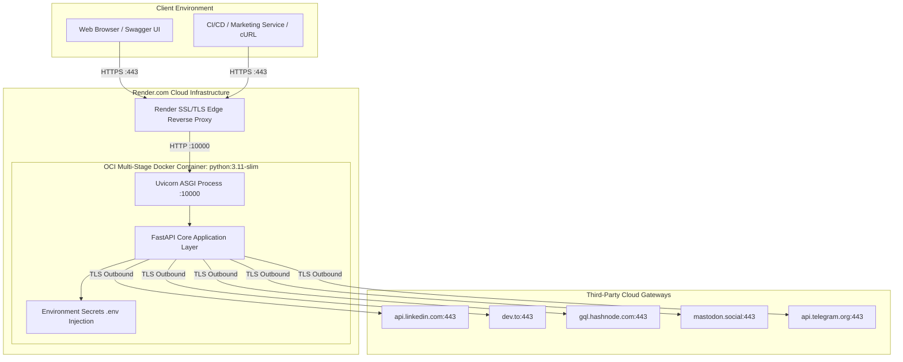

<!-- Generated by pipeline Step 13 — do not edit manually -->
# Deployment Diagram — Automated Multi-Platform Posting System

```mermaid
graph TD
    subgraph ClientDevice [Client Environment]
        Browser[Web Browser / Swagger UI]
        Automation[CI/CD / Marketing Service / cURL]
    end

    subgraph PaaSHost [Render.com Cloud Infrastructure]
        subgraph DockerContainer [OCI Multi-Stage Docker Container: python:3.11-slim]
            UvicornServer[Uvicorn ASGI Process :10000]
            FastAPIProcess[FastAPI Core Application Layer]
            EnvConfig[Environment Secrets .env Injection]
        end
        
        ReverseProxy[Render SSL/TLS Edge Reverse Proxy]
    end

    subgraph ExternalSaaS [Third-Party Cloud Gateways]
        LinkedInCloud[api.linkedin.com:443]
        DevToCloud[dev.to:443]
        HashnodeCloud[gql.hashnode.com:443]
        MastodonCloud[mastodon.social:443]
        TelegramCloud[api.telegram.org:443]
    end

    Browser -->|HTTPS :443| ReverseProxy
    Automation -->|HTTPS :443| ReverseProxy
    ReverseProxy -->|HTTP :10000| UvicornServer
    UvicornServer --> FastAPIProcess
    FastAPIProcess --> EnvConfig

    FastAPIProcess -->|TLS Outbound| LinkedInCloud
    FastAPIProcess -->|TLS Outbound| DevToCloud
    FastAPIProcess -->|TLS Outbound| HashnodeCloud
    FastAPIProcess -->|TLS Outbound| MastodonCloud
    FastAPIProcess -->|TLS Outbound| TelegramCloud
```
