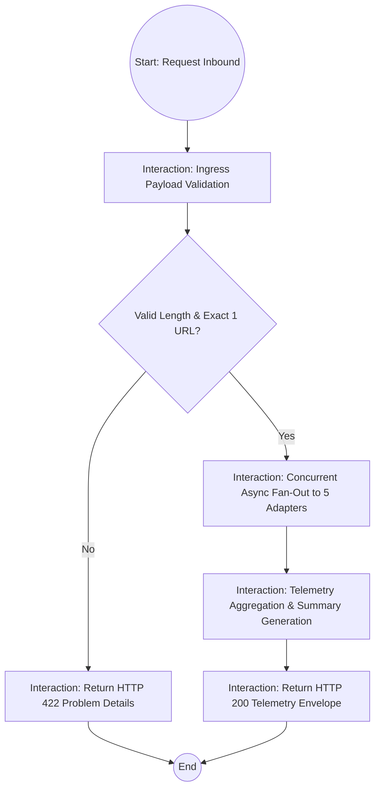

# Interaction Overview Diagram — Automated Multi-Platform Posting System

```mermaid
graph TD
    StartNode((Start: Request Inbound)) --> SD_IngressValidation[Interaction: Ingress Payload Validation]

    SD_IngressValidation --> DecisionValid{Valid Length & Exact 1 URL?}

    DecisionValid -- No --> Ref_Emit422[Interaction: Return HTTP 422 Problem Details]
    DecisionValid -- Yes --> Ref_ConcurrentFanout[Interaction: Concurrent Async Fan-Out to 5 Adapters]

    Ref_ConcurrentFanout --> Ref_AggregateTelemetry[Interaction: Telemetry Aggregation & Summary Generation]

    Ref_AggregateTelemetry --> Ref_Emit200[Interaction: Return HTTP 200 Telemetry Envelope]

    Ref_Emit422 --> EndNode((End))
    Ref_Emit200 --> EndNode
```
