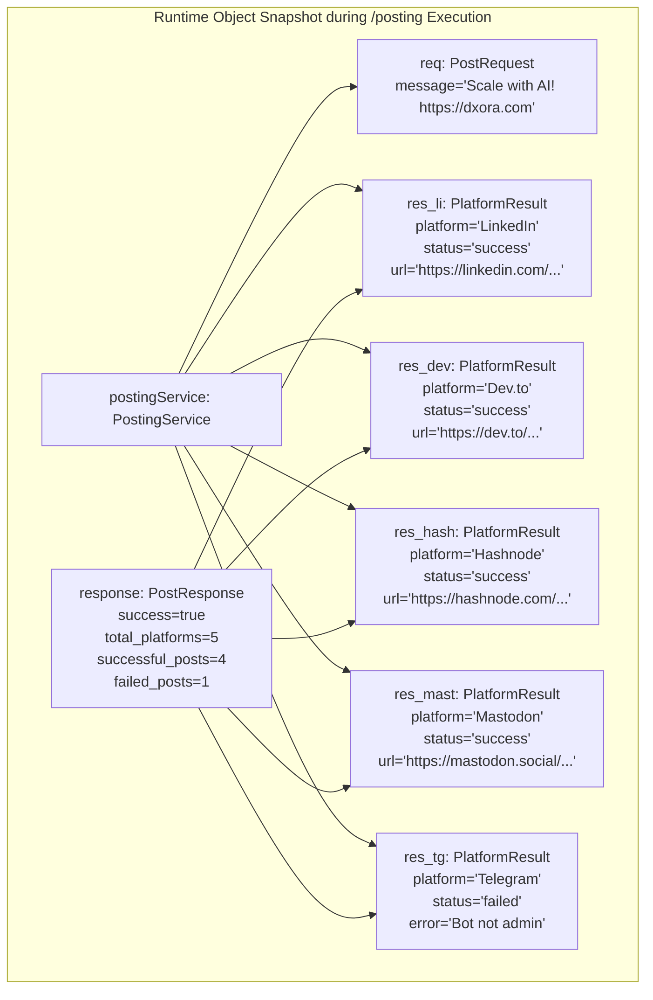

# Object Diagram — Automated Multi-Platform Posting System

```mermaid
graph TD
    subgraph RuntimeInstances [Runtime Object Snapshot during /posting Execution]
        req["req: PostRequest<br/>message='Scale with AI! https://dxora.com'"]
        
        service["postingService: PostingService"]
        
        res_li["res_li: PlatformResult<br/>platform='LinkedIn'<br/>status='success'<br/>url='https://linkedin.com/...'"]
        res_dev["res_dev: PlatformResult<br/>platform='Dev.to'<br/>status='success'<br/>url='https://dev.to/...'"]
        res_hash["res_hash: PlatformResult<br/>platform='Hashnode'<br/>status='success'<br/>url='https://hashnode.com/...'"]
        res_mast["res_mast: PlatformResult<br/>platform='Mastodon'<br/>status='success'<br/>url='https://mastodon.social/...'"]
        res_tg["res_tg: PlatformResult<br/>platform='Telegram'<br/>status='failed'<br/>error='Bot not admin'"]

        resp["response: PostResponse<br/>success=true<br/>total_platforms=5<br/>successful_posts=4<br/>failed_posts=1"]

        service --> req
        service --> res_li
        service --> res_dev
        service --> res_hash
        service --> res_mast
        service --> res_tg

        resp --> res_li
        resp --> res_dev
        resp --> res_hash
        resp --> res_mast
        resp --> res_tg
    end
```
