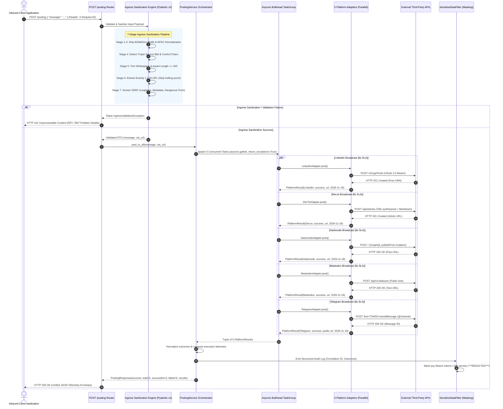

# Sequence Diagram — Automated Multi-Platform Posting System

```mermaid
sequenceDiagram
    autonumber
    actor Client as Inbound Client Application
    participant Router as POST /posting Router
    participant Sanitizer as Ingress Sanitization Engine (Pydantic v2)
    participant Service as PostingService Orchestrator
    participant Bulkhead as Asyncio Bulkhead TaskGroup
    participant Adapters as 5 Platform Adapters (Parallel)
    participant Upstream as External Third-Party APIs
    participant Logger as SensitiveDataFilter (Masking)

    Client->>Router: POST /posting { "message": "..." } (Header: X-Request-ID)
    Router->>Sanitizer: Validate & Sanitize Input Payload
    
    rect rgb(240, 248, 255)
        note over Sanitizer: 7-Stage Ingress Sanitization Pipeline
        Sanitizer->>Sanitizer: Stage 1-3: Strip BOM/Zero-Width & NFKC Normalization
        Sanitizer->>Sanitizer: Stage 4: Detect Trojan Source Bidi & Control Chars
        Sanitizer->>Sanitizer: Stage 5: Trim Whitespace & Assert Length <= 200
        Sanitizer->>Sanitizer: Stage 6: Extract Exactly 1 CTA URL (Strip trailing punct)
        Sanitizer->>Sanitizer: Stage 7: Screen SSRF (Loopback, Metadata, Dangerous Ports)
    end

    alt Ingress Sanitization / Validation Failure
        Sanitizer-->>Router: Raise IngressValidationException
        Router-->>Client: HTTP 422 Unprocessable Content (RFC 7807 Problem Details)
    else Ingress Sanitization Success
        Sanitizer-->>Router: Validated DTO (message, cta_url)
        Router->>Service: post_to_all(message, cta_url)
        
        Service->>Bulkhead: Spawn 5 Concurrent Tasks (asyncio.gather, return_exceptions=True)
        
        par LinkedIn Broadcast (8s SLA)
            Bulkhead->>Adapters: LinkedInAdapter.post()
            Adapters->>Upstream: POST /v2/ugcPosts (OAuth 2.0 Bearer)
            Upstream-->>Adapters: HTTP 201 Created (Post URN)
            Adapters-->>Bulkhead: PlatformResult(LinkedIn, success, url, 2026-11-18)
        and Dev.to Broadcast (8s SLA)
            Bulkhead->>Adapters: DevToAdapter.post()
            Adapters->>Upstream: POST /api/articles (Title synthesized + Markdown)
            Upstream-->>Adapters: HTTP 201 Created (Article URL)
            Adapters-->>Bulkhead: PlatformResult(Dev.to, success, url, 2026-11-18)
        and Hashnode Broadcast (8s SLA)
            Bulkhead->>Adapters: HashnodeAdapter.post()
            Adapters->>Upstream: POST / (GraphQL publishPost mutation)
            Upstream-->>Adapters: HTTP 200 OK (Post URL)
            Adapters-->>Bulkhead: PlatformResult(Hashnode, success, url, 2026-11-18)
        and Mastodon Broadcast (8s SLA)
            Bulkhead->>Adapters: MastodonAdapter.post()
            Adapters->>Upstream: POST /api/v1/statuses (Public toot)
            Upstream-->>Adapters: HTTP 200 OK (Toot URL)
            Adapters-->>Bulkhead: PlatformResult(Mastodon, success, url, 2026-11-18)
        and Telegram Broadcast (8s SLA)
            Bulkhead->>Adapters: TelegramAdapter.post()
            Adapters->>Upstream: POST /bot<TOKEN>/sendMessage (@channel)
            Upstream-->>Adapters: HTTP 200 OK (Message ID)
            Adapters-->>Bulkhead: PlatformResult(Telegram, success, public url, 2026-11-18)
        end
        
        Bulkhead-->>Service: Tuple of 5 PlatformResults
        Service->>Service: Normalize outcomes & compute execution telemetry
        
        Service->>Logger: Emit Structured Audit Log (Correlation ID, Outcomes)
        Logger->>Logger: Mask any Bearer tokens / API secrets (***REDACTED***)
        
        Service-->>Router: PostingResponse(success, total=5, successful=5, failed=0, results)
        Router-->>Client: HTTP 200 OK (Unified JSON Telemetry Envelope)
    end
```
