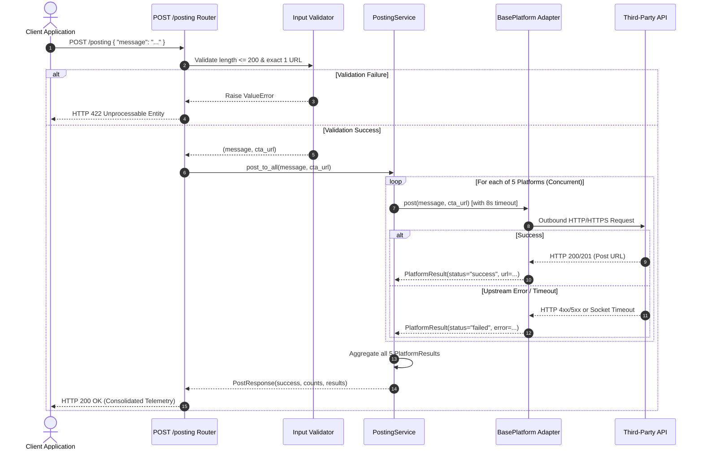

<!-- Generated by pipeline Step 13 — do not edit manually -->
# Sequence Diagram — Automated Multi-Platform Posting System

```mermaid
sequenceDiagram
    autonumber
    actor User as Client Application
    participant Router as POST /posting Router
    participant Validator as Input Validator
    participant Service as PostingService
    participant Adapter as BasePlatform Adapter
    participant ExternalAPI as Third-Party API

    User->>Router: POST /posting { "message": "..." }
    Router->>Validator: Validate length <= 200 & exact 1 URL
    alt Validation Failure
        Validator-->>Router: Raise ValueError
        Router-->>User: HTTP 422 Unprocessable Entity
    else Validation Success
        Validator-->>Router: (message, cta_url)
        Router->>Service: post_to_all(message, cta_url)
        
        loop For each of 5 Platforms (Concurrent)
            Service->>Adapter: post(message, cta_url) [with 8s timeout]
            Adapter->>ExternalAPI: Outbound HTTP/HTTPS Request
            alt Success
                ExternalAPI-->>Adapter: HTTP 200/201 (Post URL)
                Adapter-->>Service: PlatformResult(status="success", url=...)
            else Upstream Error / Timeout
                ExternalAPI-->>Adapter: HTTP 4xx/5xx or Socket Timeout
                Adapter-->>Service: PlatformResult(status="failed", error=...)
            end
        end
        
        Service->>Service: Aggregate all 5 PlatformResults
        Service-->>Router: PostResponse(success, counts, results)
        Router-->>User: HTTP 200 OK (Consolidated Telemetry)
    end
```
