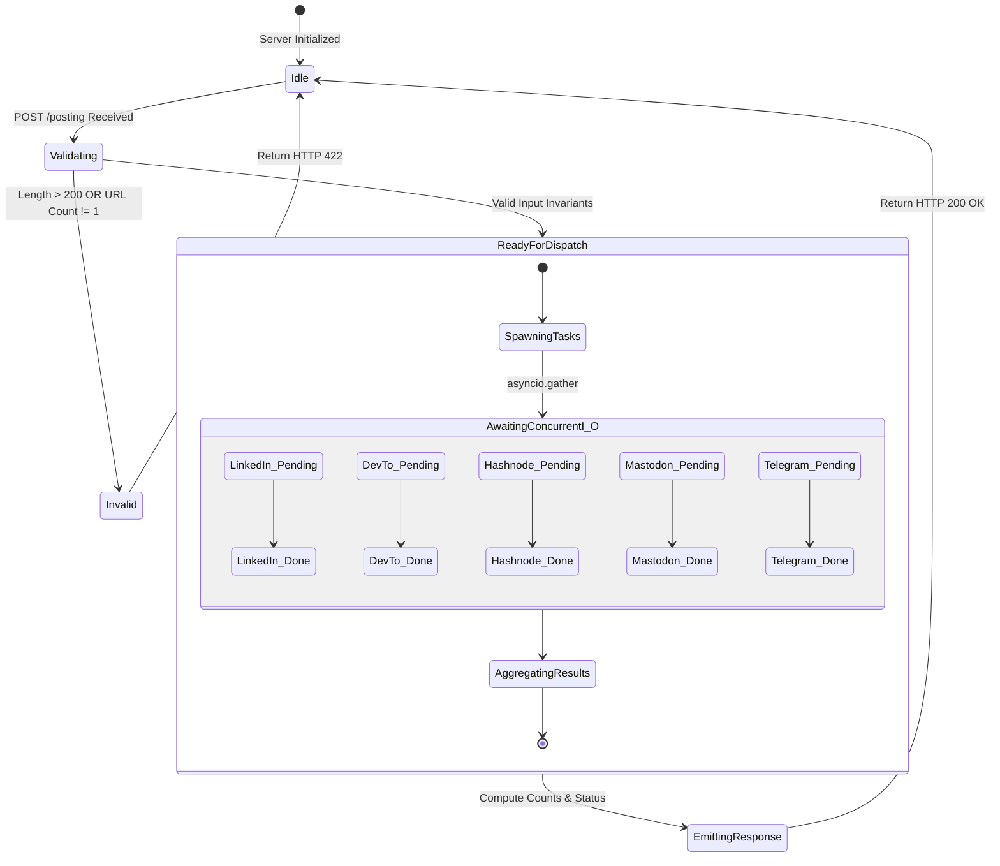

<!-- Generated by pipeline Step 13 — do not edit manually -->
# State Diagram — Automated Multi-Platform Posting System

```mermaid
stateDiagram-v2
    [*] --> Idle: Server Initialized

    Idle --> Validating: POST /posting Received
    
    Validating --> Invalid: Length > 200 OR URL Count != 1
    Invalid --> Idle: Return HTTP 422
    
    Validating --> ReadyForDispatch: Valid Input Invariants

    state ReadyForDispatch {
        [*] --> SpawningTasks
        SpawningTasks --> AwaitingConcurrentI_O: asyncio.gather
        
        state AwaitingConcurrentI_O {
            LinkedIn_Pending --> LinkedIn_Done
            DevTo_Pending --> DevTo_Done
            Hashnode_Pending --> Hashnode_Done
            Mastodon_Pending --> Mastodon_Done
            Telegram_Pending --> Telegram_Done
        }
        
        AwaitingConcurrentI_O --> AggregatingResults
        AggregatingResults --> [*]
    }

    ReadyForDispatch --> EmittingResponse: Compute Counts & Status
    EmittingResponse --> Idle: Return HTTP 200 OK
```
