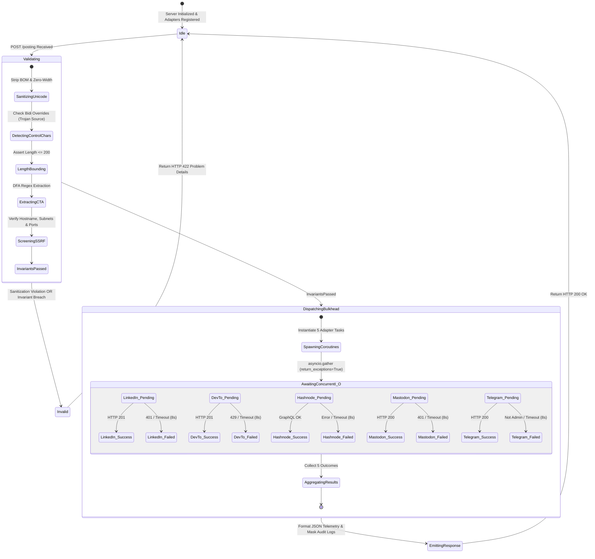

# State Diagram — Automated Multi-Platform Posting System

```mermaid
stateDiagram-v2
    [*] --> Idle: Server Initialized & Adapters Registered

    Idle --> Validating: POST /posting Received
    
    state Validating {
        [*] --> SanitizingUnicode: Strip BOM & Zero-Width
        SanitizingUnicode --> DetectingControlChars: Check Bidi Overrides (Trojan Source)
        DetectingControlChars --> LengthBounding: Assert Length <= 200
        LengthBounding --> ExtractingCTA: DFA Regex Extraction
        ExtractingCTA --> ScreeningSSRF: Verify Hostname, Subnets & Ports
        ScreeningSSRF --> InvariantsPassed
    }

    Validating --> Invalid: Sanitization Violation OR Invariant Breach
    Invalid --> Idle: Return HTTP 422 Problem Details
    
    Validating --> DispatchingBulkhead: InvariantsPassed

    state DispatchingBulkhead {
        [*] --> SpawningCoroutines: Instantiate 5 Adapter Tasks
        SpawningCoroutines --> AwaitingConcurrentI_O: asyncio.gather (return_exceptions=True)
        
        state AwaitingConcurrentI_O {
            LinkedIn_Pending --> LinkedIn_Success: HTTP 201
            LinkedIn_Pending --> LinkedIn_Failed: 401 / Timeout (8s)
            
            DevTo_Pending --> DevTo_Success: HTTP 201
            DevTo_Pending --> DevTo_Failed: 429 / Timeout (8s)
            
            Hashnode_Pending --> Hashnode_Success: GraphQL OK
            Hashnode_Pending --> Hashnode_Failed: Error / Timeout (8s)
            
            Mastodon_Pending --> Mastodon_Success: HTTP 200
            Mastodon_Pending --> Mastodon_Failed: 401 / Timeout (8s)
            
            Telegram_Pending --> Telegram_Success: HTTP 200
            Telegram_Pending --> Telegram_Failed: Not Admin / Timeout (8s)
        }
        
        AwaitingConcurrentI_O --> AggregatingResults: Collect 5 Outcomes
        AggregatingResults --> [*]
    }

    DispatchingBulkhead --> EmittingResponse: Format JSON Telemetry & Mask Audit Logs
    EmittingResponse --> Idle: Return HTTP 200 OK
```
